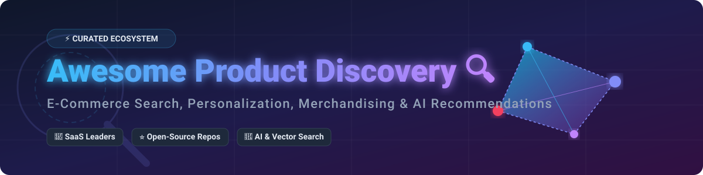

# Awesome Product Discovery 🔍

## 🚀 Top Product Discovery Platforms Ecosystem

**Curated List of E-Commerce Site Search, Merchandising, AI Recommendations & Open-Source Search Engines** 🛍️✨

*Empowering online retailers, search engineers, product managers, and digital commerce developers to build high-converting, lightning-fast shopping experiences.* ⚡

**Last updated: August 2026** 📅

---

### 💡 Overview & SEO Highlights

Welcome to **Awesome Product Discovery** — the definitive guide to commercial **SaaS product discovery platforms** and self-hosted **open-source search engines**! 🚀

Modern e-commerce product discovery powers on-site search, category navigation, semantic vector search, visual search, autocomplete, automated merchandising, and personalized recommendations. Whether you are looking for enterprise cloud solutions (Algolia, Bloomreach, Coveo) or developer-centric open-source engines (Elasticsearch, Meilisearch, Typesense, Qdrant, Milvus), this repository covers the entire ecosystem.

---

## 📑 Table of Contents
- [🏢 SaaS/Hosted Platforms](#-saashosted-platforms)
- [💻 Open-Source GitHub Projects](#-open-source-github-projects)
- [🛠️ Frameworks for Custom Discovery Systems](#-frameworks-for-building-custom-systems)
- [🤝 How to Contribute](#-how-to-contribute)
- [⚠️ Disclaimer](#%EF%B8%8F-disclaimer)
- [📊 Star History](#-star-history)

---

## 🏢 SaaS/Hosted Platforms

The following commercial SaaS and hosted cloud platforms provide enterprise search, automated merchandising, customer intelligence, and personalized recommendations. *Sorted by estimated company size (Revenue / Valuation) in descending order.* 📈

| Platform | Description | Estimated Company Size (Revenue / Valuation) | Pricing | Free Tier / Trial Limit |
| :--- | :--- | :--- | :--- | :--- |
| **[Bloomreach Discovery](https://www.bloomreach.com/)** 🌸 | Enterprise product discovery & search platform combining AI, merchandising, and customer data capabilities. | **~$260M+ ARR** / **~$2.2B Valuation** 💰 | Custom quote-based (typically starts around **$2,917/month** / $35k/year) | No free trial (API documentation playground available for developers) |
| **[Algolia](https://www.algolia.com/)** ⚡ | Developer-first search & discovery API known for sub-millisecond response times, AI ranking, and rich UI kits. | **~$100M+ ARR** / **~$2.3B Valuation** 🦄 | Starts at **$0/month** (Grow plan with pay-as-you-go overage: $0.50 per 1k searches) | **10,000 search requests/month** & 100,000 records on Build/Grow free tier |
| **[Constructor](https://constructor.com/)** 🎯 | AI-first product discovery platform optimizing search, browse, and recommendations using clickstream behavioral signals. | **~$60.3M ARR** / **~$180.8M Valuation** 📊 | Custom enterprise quotes (typically **$100,000+/year**) | No standard free trial (Custom Value Assessment / PoC on request) |
| **[Coveo](https://www.coveo.com/)** 🧠 | Enterprise AI relevance platform delivering unified search, generative answering, and discovery across commerce and service. | **~$38M Quarterly / ~$150M+ ARR** (**Public: TSX CVO, ~$1.1B Market Cap**) 🏛️ | Custom quote-based (Salesforce integrations start at **$990/month**) | **14-day free trial** (up to 100k queries/month in trial environment) |
| **[Empathy.co](https://www.empathy.co/)** 🔒 | Privacy-first search & discovery platform emphasizing ethical data usage, custom UX, and transparent AI technology. | **~$25.2M ARR** / **~$75.6M Valuation** 🛡️ | Custom enterprise quotes (typically starts around **$5,000/month**) | No free trial available (Custom enterprise demo provided) |
| **[Nosto](https://www.nosto.com/)** 🛍️ | Personalization & product discovery platform delivering recommendations, search, UGC, and targeted experiences. | **~$19.6M ARR** / **~$60M+ Est. Valuation** 🎯 | Custom quote-based (typically starts around **$500/month**) | No self-service free trial (Custom Proof of Concept available) |
| **[Searchspring](https://searchspring.com/)** 🔍 | E-commerce search, navigation, and visual merchandising platform designed to improve product findability and conversion. | **~$16.1M ARR** / **Acquired by Scaleworks** 🏢 | Custom quote-based (starts at approx **$599/month**) | No free trial available (Paid proof-of-concept / demo only) |
| **[Luigi’s Box](https://www.luigisbox.com/)** 📦 | Product discovery & search platform focused on relevance tuning, analytics, and merchandising for online stores. | **~$15.5M ARR** / **~$46.5M Valuation** 💶 | Starts at **€79/month** (Self-integration tier) | **30-day free trial** across Search, Recommender, and Analytics |
| **[Unbxd](https://unbxd.com/)** 🛒 | AI-powered e-commerce search, merchandising, and personalization platform (part of Netcore Cloud). | **~$10M–$34M ARR** / **~$405M Parent Group Valuation** 🌐 | Custom enterprise quotes | **14-day to 21-day free trial** via developer console |
| **[Klevu](https://www.klevu.com/)** 🤖 | AI-powered site search and product discovery solution popular with mid-market & Shopify merchants. | **~$7.7M–$14.8M ARR** / **~$23.1M Valuation** 🚀 | Starts at **$449/month** (Shopify Recommendations tier) | **14-day free trial** with full feature access |

---

## 💻 Open-Source GitHub Projects

These open-source search engines, vector databases, and merchandising tools allow commerce teams to build custom, transparent, high-performance product discovery systems. *Sorted by GitHub Star count in descending order.* ⭐

- **[Elasticsearch](https://github.com/elastic/elasticsearch)**  🔍  
  Powerful distributed search and analytics engine widely used for large-scale product catalogs, full-text search, and complex relevance tuning.

- **[Meilisearch](https://github.com/meilisearch/meilisearch)**  ⚡  
  Lightning-fast, open-source search engine with typo tolerance, hybrid search, and an intuitive API — ideal for e-commerce product discovery experiences.

- **[Milvus](https://github.com/milvus-io/milvus)**  🌌  
  Highly scalable open-source vector database built for cloud-native AI search, multimodal product similarity, and large-scale embedding storage.

- **[Typesense](https://github.com/typesense/typesense)**  🚀  
  Fast, open-source, in-memory search engine designed as a developer-friendly alternative to Algolia, supporting typo tolerance, faceting, and vector search.

- **[Qdrant](https://github.com/qdrant/qdrant)**  🎯  
  High-performance Rust-based vector search engine and database, perfect for neural site search, hybrid keyword-vector retrieval, and recommendations.

- **[OpenSearch](https://github.com/opensearch-project/OpenSearch)**  🌐  
  Community-driven, open-source fork of Elasticsearch managed by AWS and community partners, frequently deployed for e-commerce catalog search.

- **[LanceDB](https://github.com/lancedb/lancedb)**  🏹  
  Developer-friendly multi-modal vector database for vector search, cross-modal product image discovery, and embedded AI search.

- **[Vespa](https://github.com/vespa-engine/vespa)**  ⚙️  
  Open-source big data serving engine that supports full-text search, vector search, machine learning ranking, and recommendations at massive scale.

- **[Apache Solr](https://github.com/apache/solr)**  🏛️  
  Enterprise open-source search platform built on Apache Lucene with rich features for faceting, highlighting, spellchecking, and large-scale catalog indexing.

- **[Quickwit](https://github.com/quickwit-oss/quickwit)**  🦀  
  Cloud-native, sub-second search engine written in Rust and built on object storage (S3/GCS), ideal for high-volume catalog logs and product indexing.

- **[Infinity](https://github.com/infiniflow/infinity)**  ♾️  
  AI-native hybrid search engine combining vector search, full-text search, and structured filtering for next-gen e-commerce product search.

---

## 🛠️ Frameworks for Building Custom Systems

To build a fully self-hosted, custom product discovery stack, consider combining:
1. **Search & Vector Engines**: [Meilisearch](https://github.com/meilisearch/meilisearch), [Typesense](https://github.com/typesense/typesense), [Qdrant](https://github.com/qdrant/qdrant), or [Elasticsearch](https://github.com/elastic/elasticsearch).
2. **Frontend UI Libraries**: InstantSearch.js / Typesense-InstantSearch or Meilisearch-JS SDKs.
3. **Merchandising & Ranking Logic**: Custom rule engines for boosting featured items, pin-to-top rules, out-of-stock deprioritization, and promotional banners.
4. **ETL & Catalog Pipelines**: Connectors syncing Shopify, Magento/Adobe Commerce, WooCommerce, or BigCommerce catalog feeds into search indices.

---

## 🤝 How to Contribute

Contributions are warmly welcomed! 🌟 To contribute:
1. Fork this repository. 🍴
2. Add or update entries in `README.md` maintaining proper sorted order (alphabetical or metric-based). 📑
3. Ensure descriptions remain objective, links are working, and appropriate star badges are included. 🔗
4. Open a Pull Request with a clear description of your changes. 🚀

---

## ⚠️ Disclaimer

- This repository is a **community-curated** list for informational and educational purposes. ℹ️
- E-commerce conversion directly depends on relevance, speed, and user experience. Always conduct thorough A/B testing before making platform choices. 🔬
- Self-hosted open-source software requires dedicated infrastructure management, index optimization, security hardening, and ongoing maintenance. 🛠️

---

## 📊 Star History

<a href="https://www.star-history.com/?repos=ishandutta2007%2FAwesome-Product-Discovery&type=date&legend=bottom-right">
<picture>
<source media="(prefers-color-scheme: dark)" srcset="https://api.star-history.com/chart?repos=ishandutta2007/Awesome-Product-Discovery&type=date&theme=dark&legend=bottom-right" />
<source media="(prefers-color-scheme: light)" srcset="https://api.star-history.com/chart?repos=ishandutta2007/Awesome-Product-Discovery&type=date&legend=bottom-right" />

</picture>
</a>

---

**Made with ❤️ for e-commerce developers, search architects, and digital merchandisers worldwide.**  
*Let's build faster, smarter, and more conversion-focused product discovery experiences!* 🌐✨
